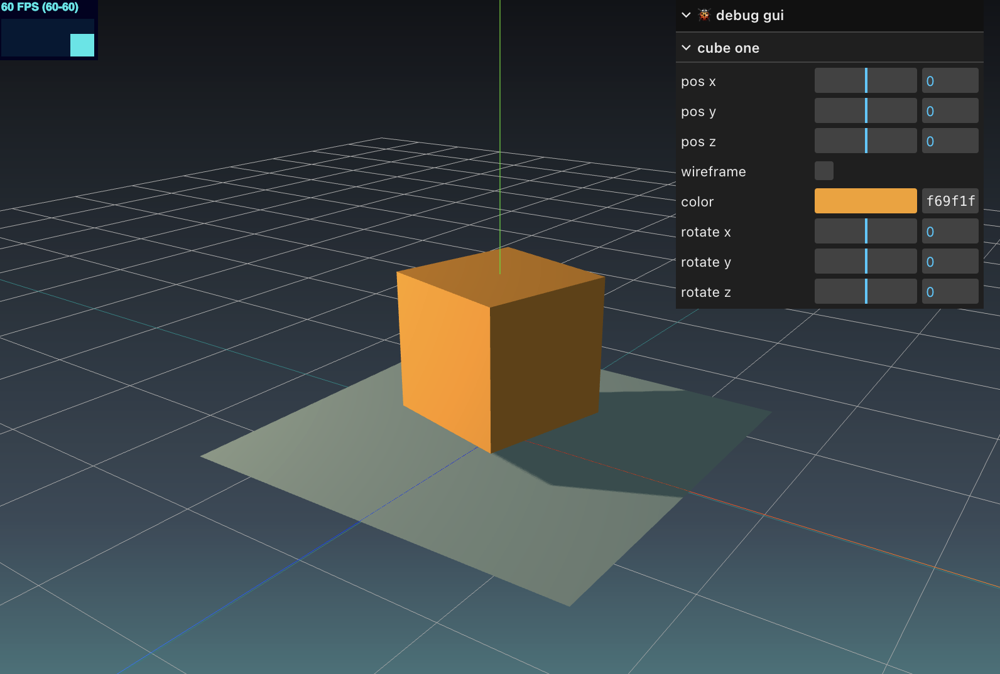

Github-CI: [![Build Status][build_status]][build_link]

[build_status]: ./../../actions/workflows/build.yml/badge.svg
[build_link]: ./../../actions/workflows/build.yml

# Three.js Journey - Challenge 20: Cozy Place

---


---

## ⚡ Quick Cloning Command

From [Community Notes - Getting Started | Vite](https://vite.dev/guide/#community-templates)

```bash
npx degit Made-of-Clay/vite-threejs-ts-template my-project
cd my-project
# my version of project init deviates this way
pnpm i
pnpm dev
```

## CLI Commands

Installation

```bash
pnpm i
```

Run dev mode

```bash
pnpm dev
```

Build

```bash
pnpm build
```

Run build

```bash
pnpm preview
```
